# 05 — Entity Relationship Diagram

Mermaid ER diagram (renders in GitHub / VSCode / Cursor preview).
The implementation lives under `backend/app/models/`.

```mermaid
erDiagram
  USERS ||--o{ USER_ROLES : has
  ROLES ||--o{ USER_ROLES : has
  ROLES ||--o{ ROLE_PERMISSIONS : has
  PERMISSIONS ||--o{ ROLE_PERMISSIONS : grants
  USERS ||--o{ USER_PERMISSIONS : override
  PERMISSIONS ||--o{ USER_PERMISSIONS : grants
  USERS ||--o{ REFRESH_TOKENS : owns
  USERS ||--o{ AUDIT_LOGS : performs
  USERS ||--o{ NOTIFICATIONS : receives

  COMPANIES ||--o{ CUSTOMERS : employs
  CUSTOMERS ||--o{ ORDERS : places
  CUSTOMERS ||--o{ LEADS : converted_from
  CUSTOMERS ||--o{ TICKETS : opens
  CUSTOMERS ||--o{ QUOTATIONS : receives
  CUSTOMERS ||--o{ INVOICES : billed
  CUSTOMERS ||--o{ PAYMENTS : pays
  CUSTOMERS ||--o{ ATTACHMENTS : uploads

  LEADS ||--o{ OPPORTUNITIES : produces
  OPPORTUNITIES ||--o{ FOLLOW_UPS : has

  ORDERS ||--o{ ORDER_ITEMS : contains
  ORDERS ||--o{ ORDER_STATUS_EVENTS : tracks
  ORDERS ||--o{ ATTACHMENTS : has
  ORDERS ||--o{ DESIGN_REVISIONS : has
  ORDERS ||--o{ PRINT_JOBS : produces
  ORDERS ||--o{ QUOTATIONS : quoted_by
  ORDERS ||--o{ INVOICES : invoiced_by

  PRODUCTS ||--o{ ORDER_ITEMS : selected
  PRODUCTS ||--o{ PRICING_RULES : priced_by
  PRODUCT_CATEGORIES ||--o{ PRODUCTS : groups

  QUOTATIONS ||--o{ QUOTATION_ITEMS : contains
  QUOTATIONS ||--o{ SIGNATURES : signed_by

  INVOICES ||--o{ INVOICE_ITEMS : contains
  INVOICES ||--o{ PAYMENTS : settled_by

  DESIGN_REVISIONS ||--o{ DESIGN_APPROVALS : awaits

  PRINT_JOBS ||--o{ MATERIAL_USAGES : consumes
  MATERIALS ||--o{ STOCK_MOVEMENTS : moves
  MATERIALS ||--o{ MATERIAL_USAGES : used_in
  WAREHOUSES ||--o{ STOCK_MOVEMENTS : holds

  TICKETS ||--o{ TICKET_MESSAGES : threads
  TICKETS ||--o{ ATTACHMENTS : has

  CAMPAIGNS ||--o{ CONTENT_POSTS : schedules
  SOCIAL_ACCOUNTS ||--o{ CONTENT_POSTS : posts

  BILLBOARDS ||--o{ INSTALLATION_PROJECTS : assigned_to
  VEHICLES ||--o{ INSTALLATION_PROJECTS : wrapped_in

  EMBROIDERY_PROJECTS ||--o{ ATTACHMENTS : has

  SCHOOLS ||--o{ ACADEMIC_REQUESTS : raises
  TEACHERS ||--o{ ACADEMIC_REQUESTS : raises
```

## Tables (summary)

Identity & RBAC
- `users`, `roles`, `permissions`, `user_roles`, `role_permissions`,
  `user_permissions`, `refresh_tokens`.

CRM
- `companies`, `customers`, `leads`, `opportunities`, `follow_ups`, `notes`.

Catalog
- `product_categories`, `products`, `pricing_rules`.

Sales & Finance
- `quotations`, `quotation_items`, `invoices`, `invoice_items`, `payments`,
  `expenses`.

Production & Design
- `orders`, `order_items`, `order_status_events`, `print_jobs`,
  `design_revisions`, `design_approvals`, `signatures`.

Inventory
- `warehouses`, `materials`, `stock_movements`, `material_usages`.

Support & Comms
- `tickets`, `ticket_messages`, `messages`, `notifications`, `attachments`.

Industry verticals (scaffold)
- `campaigns`, `content_posts`, `social_accounts`, `billboards`,
  `vehicles`, `installation_projects`, `embroidery_projects`, `schools`,
  `teachers`, `academic_requests`.

System
- `audit_logs`, `outbox_emails`.
